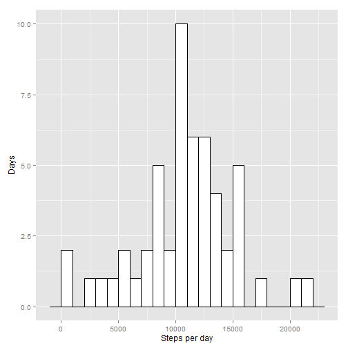
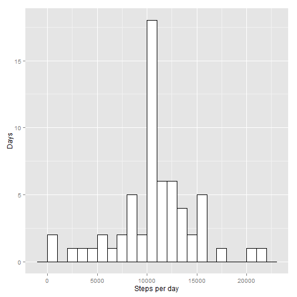

## Loading and preprocessing the data

Make sure the data file activity.csv is in the working directory.

Load the data:

```r
data <- read.csv("activity.csv", sep = ",", header = TRUE)
```

Filter out missing data:

```r
library(dplyr)
data_nona <- filter(data, !is.na(steps))
```


## What is mean total number of steps taken per day?

Calculate the total number of steps taken per day:

```r
data_nona_tot <- select(data_nona, date, steps) %>%
    group_by(date) %>% summarise_each(funs(sum))
```

Make a histogram of the total number of steps taken each day:

```r
library(ggplot2)
ggplot(data_nona_tot, aes(x = steps)) +
     geom_histogram(binwidth = 1000, color = "black", fill = "white") +
     xlab("Steps per day") +
     ylab("Days")
```

 

Calculate the median total number of steps taken each day:

```r
median(data_nona_tot$steps)
```

```
## [1] 10765
```

Calculate the mean total number of steps taken each day:

```r
mean(data_nona_tot$steps)
```

```
## [1] 10766.19
```

## What is the average daily activity pattern?
Make a time series plot of the 5-minute interval (x-axis) and the average number of steps taken, averaged across all days (y-axis):

```r
data_avg <- select(data_nona, interval, steps) %>% 
    group_by(interval) %>% summarise_each(funs(mean))
ggplot(data_avg, aes(interval, steps)) +
    geom_line() +
    xlab("Interval") +
    ylab("Number of steps")
```

 

Which 5-minute interval, on average across all the days in the dataset, contains the maximum number of steps?


```r
interval_maxsteps <- filter(data_avg, steps == max(data_avg$steps))
interval_maxsteps
```

```
## Source: local data frame [1 x 2]
## 
##   interval    steps
## 1      835 206.1698
```

The answer is 835.

## Imputing missing values

Collect missing data:

```r
data_na <- filter(data, is.na(steps))
```

There are 2304 rows with missing values. 

Let's use the mean for the 5-minute interval to fill in all of the missing values in the dataset.


```r
data_impute <- merge(select(data_na, date, interval), data_avg, 
    by.x = "interval", by.y = "interval")
```

Create a new dataset that is equal to the original dataset but with the missing data filled in:

```r
data_new <- rbind(data_nona, data_impute) %>% arrange(date, interval)
```

Make a histogram of the total number of steps taken each day:

```r
data_new_tot <- select(data_new, date, steps) %>% 
    group_by(date) %>% summarise_each(funs(sum))
ggplot(data_new_tot, aes(x = steps)) +
    geom_histogram(binwidth = 1000, color = "black", fill = "white") +
    xlab("Steps per day") +
    ylab("Days")
```

 

Calculate the median total number of steps taken each day:

```r
median(data_new_tot$steps)
```

```
## [1] 10766.19
```

Calculate the mean total number of steps taken each day:

```r
mean(data_new_tot$steps)
```

```
## [1] 10766.19
```

In comparison to the data set before imputing, the medians differ and the means are equal. The median is slightly higher after applying the imputing strategy.

## Are there differences in activity patterns between weekdays and weekends?

Create a new factor variable in the dataset with two levels - "weekday" and "weekend" indicating whether a given date is a weekday or weekend day.

```r
data_wkd <- mutate(data_new, day_type = as.factor(ifelse(weekdays(as.Date(date)) %in% 
    c("Saturday", "Sunday"), "weekend", "weekday")))
```

Make a panel plot containing a time series plot of the 5-minute interval (x-axis) and the average number of steps taken, averaged across all weekday days or weekend days (y-axis). 


```r
data_wkd_tot <- select(data_wkd, day_type, interval, steps) %>% 
    group_by(day_type, interval) %>% summarise_each(funs(mean))
ggplot(data_wkd_tot, aes(interval, steps)) +
    geom_line() +
    facet_wrap(~day_type, ncol = 1) + xlab("Interval") +
    ylab("Number of steps")
```

 

